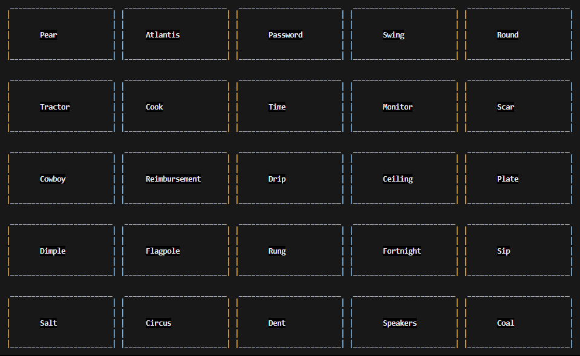
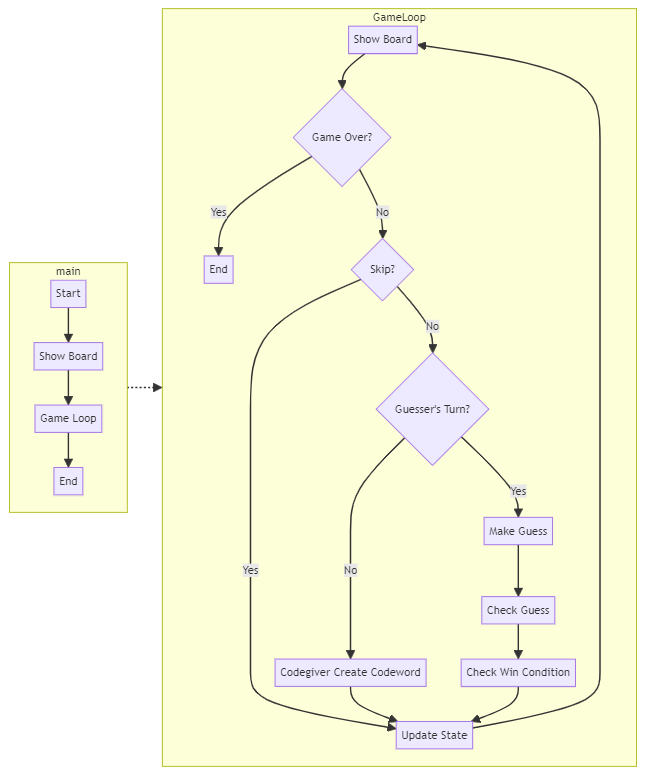
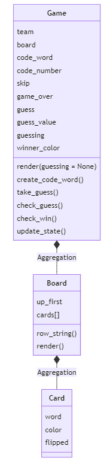
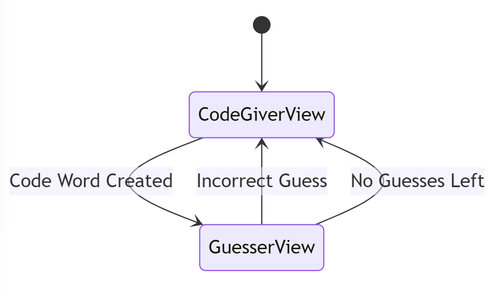

# Codenames
Codenames is a board/card game where two teams, red and blue, compete against each to be the first to guess all of their team's cards. This project uses a TUI to implement the setup of the board and the game play.



## Learning Objectives
- Familiarity with Python
- Learning to use Object Oriented Programming with Python
- Structuring a game loop
- Implementing pytest
- Understanding the process of refactoring code to make it more readable and easy to debug

## Running the Game
 ```sh
python3 main.py
 ```

## Testing the Game
```sh
cd tests
pytest -v
```

## Playing the Game
- Go get your friends. You need at least 4 people to play this game and the more the merrier.
- Once you have split into two teams, <span style="color:red;">Red</span> and <span style="color:blue;">Blue</span>, choose one person from each team to be the codegiver and the rest are guessers.
- Press `Enter` to begin, send the guessers away, and press `Enter` again.
- The board that now appears is the codegivers board. The colors for your team are displayed on the board and you must type one word that connects a few of your teams words. You will specify after you type the word how many words you are connecting. Be careful not to direct your teammates to the wrong word on accident!
    - Yellow is a neutral color. Your turn ends if you select this word.
    - Black is the death card. If the card is selected the game is instantly over and you lose.
- Once you have typed a word and the corresponding numbers, continue to the next page and call your teammates back.
- They will now guess which word they think you are referring to. 
    - If they are correct, they will continue guessing until they've guessed to the number of words that you chose. 
    - If they are incorrect your turn will end, possibly ending the game.
- Once your turn is over, the other team will go and this will continue until all of the cards for one team are guessed or the death card is selected.
- Congratulations! You've completed your first round of codenames!

## Design Documentation
### Control flow


### Class structure


### Board state machine

