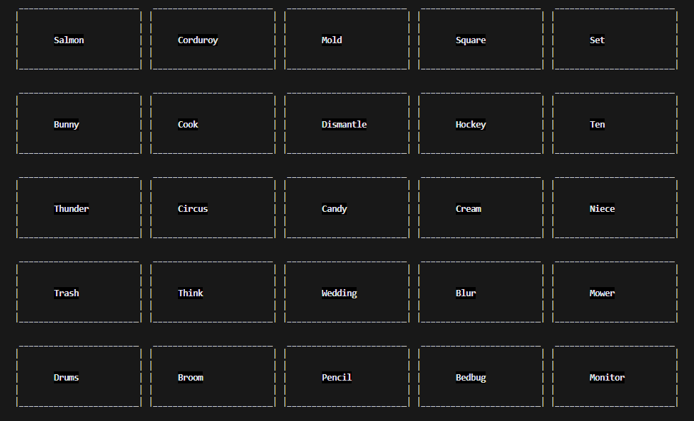

# codenames
Codenames is a board/card game where two teams compete against each to be the first to guess all of their team's cards. This project uses a TUI to implement the setup of the board and the game play

# Learning Objectives
- Familiarity with Python
- Learning to use Object Oriented Programming with Python
- Structuring a game loop
- Implementing pytest
- Understanding the process of refactoring code to make it the cleanest possible

# Building, Running, and Testing
1. Clone this repo
2. If Python is not installed on your device, install it now
3. Open a new terminal and run `python3 main.py` (Substitute python3 with your version of Python)
4. If using vscode, go to the `testing` section of the side bar and run the `codenames` test to run all the tests.

# Playing the Game
- Go get your friends. You need at least 4 people to play this game and the more the merrier
- Once you have split into two teams, Red and Blue, choose one person from each team to be the codegiver and the rest are guessers
- Press `Enter` to begin, send the guessers away, and press `Enter` again
- The board that now appears is the codegivers board. The colors for your team are displayed on the board and you must type one word in that connects a few of your teams words, specifying the number after your word. Be careful not to direct your teammates to the wrong word on accident!
    - Yellow is a nuetral color. Your turn ends if you select this word
    - Black is the death card. If the card is selected the game is instantly over and you lose
- Once your turn is over, the other team will go and this will continue until all of the cards for one team are guessed or the death card is selected.
- Congratulations! You've completed your first round of codenames!

# Design Documentation
### Control flow

### Class structure

### Board state

